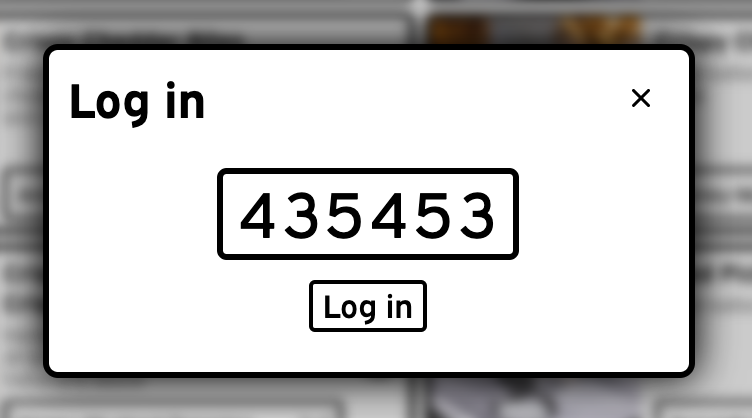
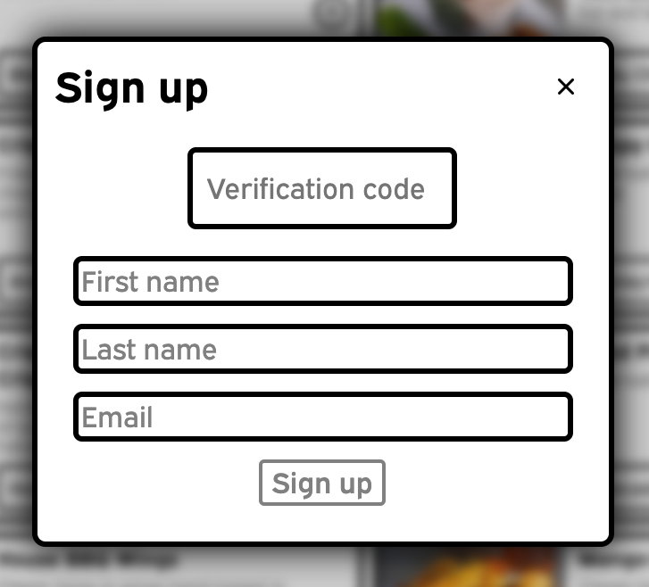
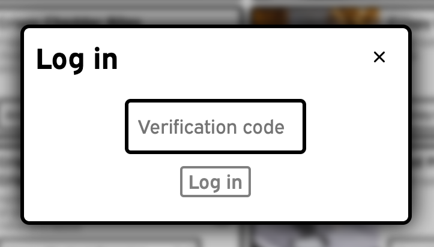

# dipper

dipper is a React web GUI for [godipper](https://www.github.com/cnnrmnn/godipper), a web API for ordering Chili's Triple Dippers for delivery via DoorDash. The Triple Dipper is a popular menu item that consists of three appetizers of the customer's choice.

## Screenshots

### Animations

### Inputs

### Modals

### Responsive layout

